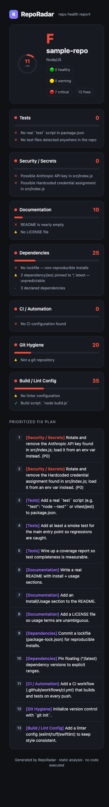
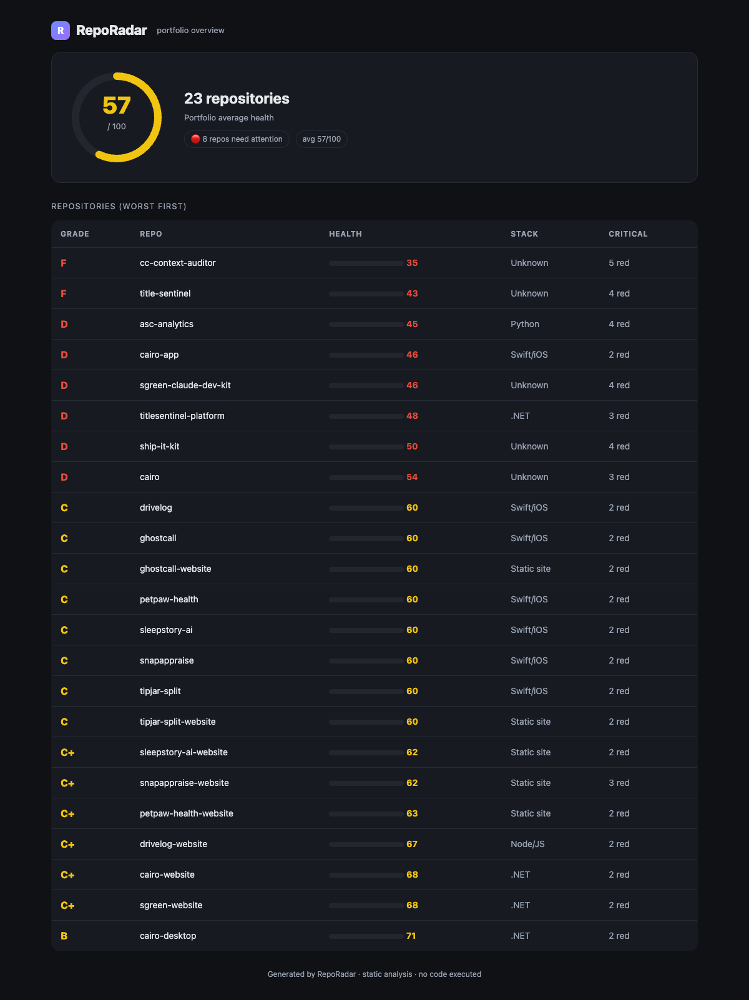

# RepoRadar

**Scan any repo. Get a health grade and a Claude-ready fix plan in seconds.**

RepoRadar is a zero-dependency CLI that scans a git repository (or a whole folder of them), scores its health green/yellow/red across 7 dimensions, and emits:

- a colored **terminal report**,
- a self-contained **HTML dashboard**,
- a machine-readable **JSON** result, and
- a **Claude Code fix plan** you paste straight into Claude Code to remediate.

It runs **static-only by default** — it inspects config and files, it does **not** execute your build. Fast and safe to point at code you don't trust.



---

## Why it exists

Every developer and every agency wants one number: *is this repo in good shape?* RepoRadar gives you that number, the evidence behind it, and — the part nobody else does — a prioritized fix plan written for an AI coding agent. Scan → score → **fix**.

The portfolio mode turns it into a manager's view: rank every repo you own worst-first and see exactly which ones leak secrets, ship no tests, or have no CI.



---

## Install

No dependencies. No `npm install`. Just **Node 18+**.

If you downloaded the release zip:

```bash
unzip reporadar-*.zip && cd reporadar
# run directly — nothing to install:
node bin/reporadar.js scan .
# or link it as a global `reporadar` command:
npm link
reporadar scan .
```

Cloning from source works the same way: `node bin/reporadar.js scan .`

## Usage

```bash
# Scan one repo, print a terminal report
reporadar scan ./my-app

# Scan + write a dashboard + a Claude fix plan
reporadar scan ./my-app --html report.html --claude FIXES.md --json report.json

# Scan every repo inside a folder (nested up to 3 levels deep), ranked worst-first,
# with one Claude fix plan per repo for an agent fleet to work through
reporadar portfolio ~/Documents/repos --html portfolio.html --claude-dir fixplans/

# See every finding, not just the criticals
reporadar scan . --verbose
```

Exit codes: `0` healthy/warning, `2` red (critical) — wire it into CI to fail a build that regresses.

### Excluding paths (`.reporadarignore`)

Drop a `.reporadarignore` at the repo root to keep vendored code, generated output, or test fixtures out of the scan (gitignore-style: bare names match a segment at any depth, `path/` is anchored to the root, `*`/`**` globs work). This is opt-in per repo, so it never weakens secret detection for a repo that has no ignore file:

```
# .reporadarignore
demo/
vendor/
**/__fixtures__
```

## The 7 dimensions

| Dimension | Weight | What it checks |
|---|---|---|
| Tests | 20 | test script, test files, coverage tooling |
| Security / Secrets | 18 | hardcoded API keys, private keys, committed `.env` |
| Documentation | 15 | README depth, install/usage sections, LICENSE |
| Dependencies | 15 | lockfile present, floating (`*`/`latest`) versions |
| CI / Automation | 12 | GitHub Actions / Jenkins / GitLab CI, tests-in-CI |
| Git Hygiene | 10 | `.gitignore`, clean tree, commit history, staleness |
| Build / Lint Config | 10 | linter + formatter config, build script |

Each dimension scores 0–100; the overall grade (A–F) is the weighted average.

## Free vs Pro vs Team

RepoRadar is freemium. The **free** path is the live scan and the A-F grade for
any repo — the "is this healthy?" answer. The **Pro** download ($39 one-time)
adds the HTML dashboard, JSON export, portfolio mode, and the Claude Code
fix-plan generator (the part that actually fixes the repo), plus updates. The
**Team / Agency** tier ($149 one-time) adds a commercial license to scan client
repos, white-label HTML reports (`--brand "Your Agency"`), up to 10 seats, and
priority support.

Every download is the full toolkit — every feature runs, nothing is crippled.
The tiers are licensing and white-labeling, not crippled code. See
`MONETIZATION.md` for the model and where the free/paid boundary lives.

## The Claude fix plan — the differentiator

`--claude FIXES.md` writes a prioritized, agent-ready remediation plan: P0 secret findings first, then reds, then yellows, with guardrails ("never commit secrets", "commit at each checkpoint", "re-run reporadar to confirm the grade improved"). Paste it into Claude Code and the repo fixes itself.

## Try the demo

```bash
npm run demo          # scans the bundled imperfect sample repo
npm test              # runs the test suite
```

## Honest limits (v0.1)

- Static analysis only — does not run your build/tests, so "Tests" measures *presence*, not *passing*.
- Secret detection is pattern-based (high-signal patterns); it is not a replacement for a dedicated scanner like gitleaks.
- Stack-specific depth (e.g. real `npm audit` CVEs) is on the roadmap, not in v0.1.

See `CHANGELOG.md` for release history and what ships next.

## License

MIT.
